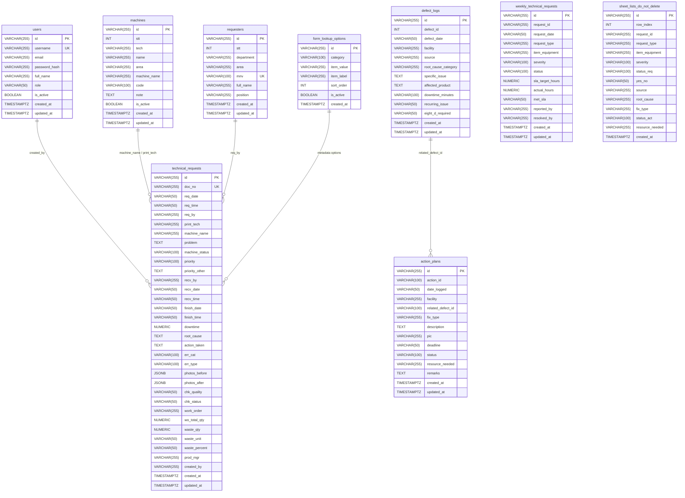

# HƯỚNG DẪN CƠ SỞ DỮ LIỆU & QUY TRÌNH MỞ RỘNG TRƯỜNG DỮ LIỆU
## CHECKPOINT SYSTEMS — TECHNICAL REQUEST MANAGEMENT SYSTEM

---

## 1. TỔNG QUAN KIẾN TRÚC CƠ SỞ DỮ LIỆU (DATABASE ARCHITECTURE)

Hệ thống quản lý phiếu yêu cầu kỹ thuật của **Checkpoint Systems** áp dụng mô hình lưu trữ kết hợp (Hybrid Dual-Layer Persistence):
1. **Lớp Cơ Sở Dữ Liệu Quan Hệ (PostgreSQL 16+)**: Đóng vai trò là nguồn dữ liệu chuẩn (Single Source of Truth), đảm bảo tính toàn vẹn (ACID), khả năng mở rộng, lưu trữ lâu dài và phục vụ các truy vấn phức tạp, báo cáo thống kê KPI.
2. **Lớp In-Memory Cache (RAM)**: Đồng bộ với PostgreSQL khi khởi động ứng dụng, mang lại tốc độ phản hồi tính bằng mili-giây (sub-millisecond) cho các thao tác đọc và tra cứu danh mục.
3. **Cơ chế Fallback JSON**: Khi ứng dụng chưa kết nối được tới PostgreSQL (ví dụ khi khởi động offline tại môi trường phát triển), hệ thống tự động duy trì hoạt động thông qua tệp JSON trong thư mục `data/` mà không làm gián đoạn trải nghiệm người dùng.

### Thông Số Kết Nối Chuẩn (Môi Trường Checkpoint Systems)
- **Host**: `192.168.1.35` (hoặc cấu hình qua biến môi trường `POSTGRES_HOST`)
- **Port**: `5432` (`POSTGRES_PORT`)
- **Username**: `admin` (`POSTGRES_USER` / `DB_USER`)
- **Password**: `Ph@nloi20031403` (`POSTGRES_PASSWORD` / `DB_PASSWORD`)
- **Database Name**: `checkpoint` (`POSTGRES_DB` / `DB_NAME`)
- **Tự động khởi tạo Schema**: `DB_AUTO_INIT=true`

---

## 2. SƠ ĐỒ THỰC THỂ QUAN HỆ (ERD - ENTITY RELATIONSHIP DIAGRAM)



---

## 3. CHI TIẾT TỪNG BẢNG & TRƯỜNG DỮ LIỆU (DATABASE SCHEMA SPECIFICATION)

### 3.1. Bảng `technical_requests` (Phiếu Yêu Cầu Kỹ Thuật Biểu Mẫu V4.1)
Bảng trung tâm lưu trữ toàn bộ chu trình xử lý của một sự vụ kỹ thuật: tiếp nhận, kiểm tra máy móc, nguyên nhân 4M, hành động xử lý, hình ảnh trước/sau và nghiệm thu sản xuất.

| Tên Cột | Kiểu Dữ Liệu | Ràng Buộc | Mô Tả Nghiệp Vụ |
| :--- | :--- | :--- | :--- |
| `id` | `VARCHAR(255)` | `PRIMARY KEY` | Khóa chính (UUID v4) |
| `doc_no` | `VARCHAR(255)` | `UNIQUE NOT NULL` | Mã số phiếu (Format: `REQ-YYYYMMDD-HHmmss`) |
| `req_date` | `VARCHAR(50)` | `NULLABLE` | Ngày phát sinh yêu cầu (Format: `YYYY-MM-DD`) |
| `req_time` | `VARCHAR(50)` | `NULLABLE` | Giờ phát sinh yêu cầu (Format: `HH:mm`) |
| `req_by` | `VARCHAR(255)` | `NULLABLE` | Tên & MNV người yêu cầu (vd: `Nguyễn Văn A - NV001`) |
| `print_tech` | `VARCHAR(255)` | `NULLABLE` | Công nghệ in (`PFL`, `OFFSET`, `DIGITAL`, `HTL`, `SILKSCREEN`, `WOVEN`) |
| `machine_name` | `VARCHAR(255)` | `NULLABLE` | Tên máy thiết bị gặp sự cố (vd: `SM 52`, `CD 102`) |
| `problem` | `TEXT` | `NULLABLE` | Mô tả chi tiết hiện tượng / sự cố thiết bị |
| `machine_status` | `VARCHAR(100)` | `NULLABLE` | Trạng thái máy khi xảy ra sự cố (`First Bulk Print`, `Repeat Print`) |
| `priority` | `VARCHAR(100)` | `NULLABLE` | Mức độ ưu tiên (`Immediate`, `Hold`, `Other`) |
| `priority_other`| `TEXT` | `NULLABLE` | Ghi chú thêm khi chọn ưu tiên Other |
| `recv_by` | `VARCHAR(255)` | `NULLABLE` | Kỹ thuật viên tiếp nhận xử lý (Tên + MNV) |
| `recv_date` | `VARCHAR(50)` | `NULLABLE` | Ngày kỹ thuật viên tiếp nhận xử lý |
| `recv_time` | `VARCHAR(50)` | `NULLABLE` | Giờ tiếp nhận xử lý |
| `finish_date` | `VARCHAR(50)` | `NULLABLE` | Ngày hoàn tất xử lý |
| `finish_time` | `VARCHAR(50)` | `NULLABLE` | Giờ hoàn tất xử lý |
| `downtime` | `NUMERIC` | `DEFAULT 0` | Thời gian gián đoạn sản xuất (tính theo phút) |
| `root_cause` | `TEXT` | `NULLABLE` | Nguyên nhân gốc rễ gây ra lỗi |
| `action_taken` | `TEXT` | `NULLABLE` | Hành động khắc phục / sửa chữa cụ thể |
| `err_cat` | `VARCHAR(100)` | `NULLABLE` | Phân loại lỗi theo mô hình 4M (`MAN`, `MACHINE`, `MATERIAL`, `METHOD`) |
| `err_type` | `VARCHAR(100)` | `NULLABLE` | Công đoạn phát sinh lỗi (`Prepress`, `Press`, `PostPress`) |
| `photos_before` | `JSONB` | `DEFAULT '[]'` | Mảng ảnh trước khi sửa chữa (Data URL base64) |
| `photos_after` | `JSONB` | `DEFAULT '[]'` | Mảng ảnh sau khi sửa chữa (Data URL base64) |
| `chk_quality` | `VARCHAR(50)` | `NULLABLE` | Nghiệm thu chất lượng in (`OK` hoặc `NG`) |
| `chk_status` | `VARCHAR(50)` | `NULLABLE` | Trạng thái phiếu (`DONE`, `MONITOR`, `SUPPORT`) |
| `work_order` | `VARCHAR(255)` | `NULLABLE` | Mã lệnh sản xuất (Work Order / Lô hàng) |
| `wo_total_qty` | `NUMERIC` | `DEFAULT 0` | Tổng sản lượng đơn hàng theo lệnh |
| `waste_qty` | `NUMERIC` | `DEFAULT 0` | Số lượng phế phẩm / hao hụt |
| `waste_unit` | `VARCHAR(50)` | `NULLABLE` | Đơn vị tính hao hụt (`Pcs`, `Tờ in`, `Mét`, `Kg`, `Cuộn`) |
| `waste_percent` | `VARCHAR(50)` | `NULLABLE` | Tỷ lệ hao hụt phần trăm (vd: `0.5%`) |
| `prod_mgr` | `VARCHAR(255)` | `NULLABLE` | Quản lý sản xuất xác nhận bàn giao |
| `created_by` | `VARCHAR(255)` | `NULLABLE` | Tài khoản tạo phiếu (Username) |
| `created_at` | `TIMESTAMPTZ` | `DEFAULT now()`| Thời gian tạo bản ghi |
| `updated_at` | `TIMESTAMPTZ` | `DEFAULT now()`| Thời gian cập nhật bản ghi gần nhất |

**Indexes**:
- `idx_tech_req_doc_no` trên `technical_requests(doc_no)`

---

### 3.2. Bảng `users` (Quản Lý Người Dùng & Phân Quyền)
Quản lý tài khoản đăng nhập hệ thống, hỗ trợ cơ chế RBAC (Role-Based Access Control).

| Tên Cột | Kiểu Dữ Liệu | Ràng Buộc | Mô Tả Nghiệp Vụ |
| :--- | :--- | :--- | :--- |
| `id` | `VARCHAR(255)` | `PRIMARY KEY` | Định danh tài khoản (UUID v4) |
| `username` | `VARCHAR(255)` | `UNIQUE NOT NULL` | Tên đăng nhập |
| `email` | `VARCHAR(255)` | `NOT NULL` | Địa chỉ email liên hệ |
| `password_hash`| `VARCHAR(255)` | `NOT NULL` | Mật khẩu băm an toàn qua `bcryptjs` |
| `full_name` | `VARCHAR(255)` | `NOT NULL` | Họ và tên đầy đủ |
| `role` | `VARCHAR(50)` | `DEFAULT 'EMPLOYEE'` | Vai trò người dùng (`ADMIN`, `TECHNICIAN`, `EMPLOYEE`) |
| `is_active` | `BOOLEAN` | `DEFAULT true` | Trạng thái kích hoạt tài khoản |
| `created_at` | `TIMESTAMPTZ` | `DEFAULT now()` | Thời điểm tạo tài khoản |
| `updated_at` | `TIMESTAMPTZ` | `DEFAULT now()` | Thời điểm cập nhật tài khoản |

**Indexes**:
- `idx_users_username` trên `users(username)`

---

### 3.3. Bảng `machines` (Danh Mục Thiết Bị Máy Móc)
Lưu danh sách thiết bị sản xuất theo từng khu vực và công nghệ in (nhập từ Master Data Excel).

| Tên Cột | Kiểu Dữ Liệu | Ràng Buộc | Mô Tả Nghiệp Vụ |
| :--- | :--- | :--- | :--- |
| `id` | `VARCHAR(255)` | `PRIMARY KEY` | Khóa chính |
| `stt` | `INT` | `DEFAULT 0` | Số thứ tự hiển thị |
| `tech` | `VARCHAR(255)` | `NULLABLE` | Mã công nghệ in (`PFL`, `OFFSET`, `DIGITAL`, `HTL`, `SILKSCREEN`, `WOVEN`) |
| `name` | `VARCHAR(255)` | `NULLABLE` | Tên máy thiết bị |
| `area` | `VARCHAR(255)` | `NULLABLE` | Khu vực đặt máy (vd: Xưởng 1, Khu vực Offset) |
| `machine_name` | `VARCHAR(255)` | `NULLABLE` | Tên máy mở rộng |
| `code` | `VARCHAR(100)` | `NULLABLE` | Mã số thiết bị quản lý nội bộ |
| `note` | `TEXT` | `NULLABLE` | Ghi chú bảo trì hoặc đặc tả máy |
| `is_active` | `BOOLEAN` | `DEFAULT true` | Đang vận hành hay tạm ngừng |
| `created_at` | `TIMESTAMPTZ` | `DEFAULT now()` | Ngày tạo |
| `updated_at` | `TIMESTAMPTZ` | `DEFAULT now()` | Ngày cập nhật |

**Indexes**:
- `idx_machines_tech` trên `machines(tech)`
- `idx_machines_name` trên `machines(name)`

---

### 3.4. Bảng `requesters` (Danh Bạ Nhân Viên Yêu Cầu Hỗ Trợ)
Lưu trữ thông tin nhân sự vận hành máy và người tạo yêu cầu kỹ thuật.

| Tên Cột | Kiểu Dữ Liệu | Ràng Buộc | Mô Tả Nghiệp Vụ |
| :--- | :--- | :--- | :--- |
| `id` | `VARCHAR(255)` | `PRIMARY KEY` | Khóa chính |
| `stt` | `INT` | `NULLABLE` | Số thứ tự |
| `department` | `VARCHAR(255)` | `NULLABLE` | Bộ phận (vd: Sản xuất, In ấn, Thành phẩm) |
| `area` | `VARCHAR(255)` | `NULLABLE` | Khu vực làm việc |
| `mnv` | `VARCHAR(100)` | `UNIQUE NOT NULL` | Mã số nhân viên Checkpoint Systems (vd: `NV001`) |
| `full_name` | `VARCHAR(255)` | `NOT NULL` | Họ và tên nhân viên |
| `position` | `VARCHAR(255)` | `NULLABLE` | Vị trí công tác (vd: Kỹ thuật trưởng, Thợ in chính) |
| `created_at` | `TIMESTAMPTZ` | `DEFAULT now()` | Ngày tạo |
| `updated_at` | `TIMESTAMPTZ` | `DEFAULT now()` | Ngày cập nhật |

**Indexes**:
- `idx_requesters_mnv` trên `requesters(mnv)`
- `idx_requesters_area` trên `requesters(area)`

---

### 3.5. Bảng `weekly_technical_requests` (Nhật Ký Yêu Cầu Hàng Tuần - Dashboard Weekly)
Dữ liệu tổng hợp các sự vụ kỹ thuật hàng tuần phục vụ báo cáo đánh giá SLA và hiệu suất.

| Tên Cột | Kiểu Dữ Liệu | Ràng Buộc | Mô Tả Nghiệp Vụ |
| :--- | :--- | :--- | :--- |
| `id` | `VARCHAR(255)` | `PRIMARY KEY` | Khóa chính |
| `request_id` | `VARCHAR(255)` | `NOT NULL` | Mã sự vụ kỹ thuật |
| `request_date` | `VARCHAR(50)` | `NULLABLE` | Ngày phát sinh |
| `request_type` | `VARCHAR(255)` | `NULLABLE` | Loại yêu cầu (Sửa chữa khẩn cấp, Bảo trì định kỳ,...) |
| `item_equipment`| `VARCHAR(255)` | `NULLABLE` | Thiết bị hoặc linh kiện liên quan |
| `severity` | `VARCHAR(100)` | `NULLABLE` | Mức độ nghiêm trọng (`Low`, `Medium`, `High`, `Critical`) |
| `status` | `VARCHAR(100)` | `NULLABLE` | Tình trạng xử lý (`Open`, `In Progress`, `Resolved`, `Closed`) |
| `sla_target_hours`| `NUMERIC` | `NULLABLE` | Thời gian cam kết khắc phục SLA (giờ) |
| `actual_hours` | `NUMERIC` | `NULLABLE` | Thời gian khắc phục thực tế (giờ) |
| `met_sla` | `VARCHAR(50)` | `NULLABLE` | Đạt cam kết SLA (`YES` / `NO`) |
| `reported_by` | `VARCHAR(255)` | `NULLABLE` | Người báo cáo sự vụ |
| `resolved_by` | `VARCHAR(255)` | `NULLABLE` | Kỹ thuật viên giải quyết |
| `created_at` | `TIMESTAMPTZ` | `DEFAULT now()` | Ngày tạo |
| `updated_at` | `TIMESTAMPTZ` | `DEFAULT now()` | Ngày cập nhật |

---

### 3.6. Bảng `defect_logs` (Nhật Ký Sự Cố & Lỗi Kỹ Thuật 8D)
Lưu vết các lỗi kỹ thuật phát sinh và đánh giá yêu cầu lập quy trình phân tích 8D.

| Tên Cột | Kiểu Dữ Liệu | Ràng Buộc | Mô Tả Nghiệp Vụ |
| :--- | :--- | :--- | :--- |
| `id` | `VARCHAR(255)` | `PRIMARY KEY` | Khóa chính |
| `defect_id` | `INT` | `NOT NULL` | Số định danh sự cố lỗi |
| `defect_date` | `VARCHAR(50)` | `NULLABLE` | Ngày ghi nhận lỗi |
| `facility` | `VARCHAR(255)` | `NULLABLE` | Nhà máy / Phân xưởng |
| `source` | `VARCHAR(255)` | `NULLABLE` | Nguồn phát hiện (Nội bộ, Khách hàng, QC,...) |
| `root_cause_category` | `VARCHAR(255)`| `NULLABLE` | Phân nhóm nguyên nhân gốc |
| `specific_issue` | `TEXT` | `NULLABLE` | Mô tả chi tiết vấn đề cụ thể |
| `affected_product` | `TEXT` | `NULLABLE` | Sản phẩm hoặc mã hàng bị ảnh hưởng |
| `downtime_minutes` | `VARCHAR(100)`| `NULLABLE` | Thời gian dừng máy (phút) |
| `recurring_issue` | `VARCHAR(50)` | `NULLABLE` | Lỗi lặp lại (`YES` / `NO`) |
| `eight_d_required` | `VARCHAR(50)` | `NULLABLE` | Bắt buộc thực hiện báo cáo 8D (`YES` / `NO`) |
| `created_at` | `TIMESTAMPTZ` | `DEFAULT now()` | Ngày tạo |
| `updated_at` | `TIMESTAMPTZ` | `DEFAULT now()` | Ngày cập nhật |

---

### 3.7. Bảng `action_plans` (Kế Hoạch Hành Động Khắc Phục Lỗi)
Ghi nhận các đầu việc phòng ngừa và khắc phục triệt để sự cố kỹ thuật.

| Tên Cột | Kiểu Dữ Liệu | Ràng Buộc | Mô Tả Nghiệp Vụ |
| :--- | :--- | :--- | :--- |
| `id` | `VARCHAR(255)` | `PRIMARY KEY` | Khóa chính |
| `action_id` | `VARCHAR(100)` | `NOT NULL` | Mã hành động |
| `date_logged` | `VARCHAR(50)` | `NULLABLE` | Ngày lập kế hoạch |
| `facility` | `VARCHAR(255)` | `NULLABLE` | Nhà xưởng |
| `related_defect_id`| `VARCHAR(100)`| `NULLABLE` | Mã lỗi liên quan (`defect_logs.defect_id`) |
| `fix_type` | `VARCHAR(255)` | `NULLABLE` | Biện pháp (`Tạm thời`, `Dài hạn`, `Cải tiến`) |
| `description` | `TEXT` | `NULLABLE` | Mô tả chi tiết hành động cần thực hiện |
| `pic` | `VARCHAR(255)` | `NULLABLE` | Người chịu trách nhiệm chính (Person In Charge) |
| `deadline` | `VARCHAR(50)` | `NULLABLE` | Hạn chót hoàn thành |
| `status` | `VARCHAR(100)` | `NULLABLE` | Tình trạng (`Pending`, `Doing`, `Done`, `Overdue`) |
| `resource_needed` | `VARCHAR(255)` | `NULLABLE` | Nguồn lực / Vật tư / Ngân sách cần thiết |
| `remarks` | `TEXT` | `NULLABLE` | Nhận xét đánh giá |
| `created_at` | `TIMESTAMPTZ` | `DEFAULT now()` | Ngày tạo |
| `updated_at` | `TIMESTAMPTZ` | `DEFAULT now()` | Ngày cập nhật |

---

### 3.8. Bảng `form_lookup_options` (Cấu Hình Danh Mục Dropdown Động)
Lưu trữ các lựa chọn trong các dropdown trên biểu mẫu V4.1 và hệ thống (thay thế cho việc hardcode).

| Tên Cột | Kiểu Dữ Liệu | Ràng Buộc | Mô Tả Nghiệp Vụ |
| :--- | :--- | :--- | :--- |
| `id` | `VARCHAR(255)` | `PRIMARY KEY` | Khóa chính |
| `category` | `VARCHAR(100)` | `NOT NULL` | Phân nhóm (`printTech`, `errCat`, `priority`,...) |
| `item_value` | `VARCHAR(255)` | `NOT NULL` | Giá trị lưu vào cơ sở dữ liệu |
| `item_label` | `VARCHAR(255)` | `NULLABLE` | Nhãn hiển thị giao diện người dùng |
| `sort_order` | `INT` | `DEFAULT 0` | Thứ tự hiển thị |
| `is_active` | `BOOLEAN` | `DEFAULT true` | Đang sử dụng hay ẩn đi |
| `created_at` | `TIMESTAMPTZ` | `DEFAULT now()` | Ngày tạo |

---

### 3.9. Bảng `sheet_lists_do_not_delete` (Bảng Tham Chiếu Gốc Excel)
Lưu trữ đồng bộ trực tiếp các dòng từ sheet `Lists_DO_NOT_DELETE` trong file Excel quản trị nguồn.

---

## 4. HƯỚNG DẪN TỪNG BƯỚC MỞ RỘNG TRƯỜNG DỮ LIỆU MỚI (STEP-BY-STEP EXTENSION GUIDE)

Dưới đây là kịch bản chuẩn hướng dẫn cách thêm một hoặc nhiều trường dữ liệu mới xuyên suốt qua toàn bộ các tầng kiến trúc:
> **Ví dụ thực tế**: Thêm 2 trường mới vào phiếu yêu cầu kỹ thuật (`technical_requests`):
> 1. `shift`: Ca sản xuất (`'CA_1'` | `'CA_2'` | `'CA_3'`) — Kiểu chuỗi ký tự `VARCHAR(50)`.
> 2. `estimated_cost`: Chi phí sửa chữa dự kiến — Kiểu số `NUMERIC DEFAULT 0`.

---

### BƯỚC 1: CẬP NHẬT CƠ SỞ DỮ LIỆU POSTGRESQL

#### Cách 1.1: Chạy lệnh DDL trực tiếp trên PostgreSQL Server
Truy cập PostgreSQL (qua DBeaver, pgAdmin hoặc `psql` trên host `192.168.1.35`):
```sql
-- Chuyển ngữ cảnh vào DB checkpoint
\c checkpoint;

-- Thêm các cột mới (sử dụng IF NOT EXISTS để đảm bảo an toàn)
ALTER TABLE technical_requests ADD COLUMN IF NOT EXISTS shift VARCHAR(50);
ALTER TABLE technical_requests ADD COLUMN IF NOT EXISTS estimated_cost NUMERIC DEFAULT 0;

-- Tạo chỉ mục (Index) nếu trường mới thường xuyên được dùng để lọc hoặc tìm kiếm
CREATE INDEX IF NOT EXISTS idx_tech_req_shift ON technical_requests(shift);
```

#### Cách 1.2: Cập nhật hàm tự động khởi tạo Schema trong mã nguồn NestJS
Mở tệp: `checkpoint_technical/src/modules/database/database.service.ts`
Tìm phương thức `initPgSchema()`:
```typescript
// Thêm câu lệnh bổ sung cột vào chuỗi SQL query của initPgSchema():
ALTER TABLE technical_requests ADD COLUMN IF NOT EXISTS shift VARCHAR(50);
ALTER TABLE technical_requests ADD COLUMN IF NOT EXISTS estimated_cost NUMERIC DEFAULT 0;
CREATE INDEX IF NOT EXISTS idx_tech_req_shift ON technical_requests(shift);
```
*Điều này đảm bảo khi hệ thống khởi động với `DB_AUTO_INIT=true`, cấu trúc cơ sở dữ liệu sẽ tự động được đồng bộ an toàn.*

---

### BƯỚC 2: CẬP NHẬT TYPESCRIPT INTERFACE (DATABASE SERVICE)

Mở tệp: `checkpoint_technical/src/modules/database/database.service.ts`

1. Cập nhật Interface `TechnicalRequestRecord`:
```typescript
export interface TechnicalRequestRecord {
  id: string;
  docNo: string;
  reqDate: string;
  reqTime: string;
  reqBy: string;
  printTech: string;
  machineName: string;
  problem: string;
  machineStatus?: string;
  priority?: string;
  priorityOther?: string;
  recvBy?: string;
  recvDate?: string;
  recvTime?: string;
  finishDate?: string;
  finishTime?: string;
  downtime?: number;
  rootCause?: string;
  actionTaken?: string;
  errCat?: string;
  errType?: string;
  photosBefore?: string[];
  photosAfter?: string[];
  chkQuality?: string;
  chkStatus?: string;
  workOrder?: string;
  woTotalQty?: number;
  wasteQty?: number;
  wasteUnit?: string;
  wastePercent?: string;
  prodMgr?: string;
  // === TRƯỜNG MỚI BỔ SUNG ===
  shift?: string;
  estimatedCost?: number;
  // ==========================
  createdBy?: string;
  createdAt: string;
  updatedAt: string;
}
```

2. Cập nhật phương thức `loadFromPg()` trong `database.service.ts`:
```typescript
// Trong đoạn map dữ liệu từ PostgreSQL row sang Cache object:
shift: r.shift || '',
estimatedCost: r.estimated_cost ? Number(r.estimated_cost) : 0,
```

3. Cập nhật phương thức `addRequest()` và `updateRequest()` trong `database.service.ts`:
Trong câu lệnh `INSERT INTO technical_requests ...`:
```typescript
// Thêm tên cột vào danh sách INSERT:
shift, estimated_cost,

// Thêm biến tham số $35, $36:
VALUES (..., $35, $36)

// Thêm vào mệnh đề ON CONFLICT (id) DO UPDATE SET:
shift = EXCLUDED.shift,
estimated_cost = EXCLUDED.estimated_cost,

// Bổ sung tham số truyền vào mảng query:
[
  // ... các tham số trước ...
  req.shift || null,
  req.estimatedCost || 0,
  // ...
]
```

---

### BƯỚC 3: CẬP NHẬT NESTJS DTO (DATA TRANSFER OBJECT)

Mở tệp: `checkpoint_technical/src/modules/technical-requests/dto/create-technical-request.dto.ts`

Bổ sung khai báo thuộc tính với các decorator của `class-validator` và `@nestjs/swagger`:
```typescript
import { ApiProperty, ApiPropertyOptional } from '@nestjs/swagger';
import { IsNotEmpty, IsOptional, IsString, IsNumber } from 'class-validator';

export class CreateTechnicalRequestDto {
  // ... các trường hiện tại ...

  @ApiPropertyOptional({ example: 'CA_1', description: 'Ca làm việc phát sinh sự vụ (CA_1, CA_2, CA_3)' })
  @IsOptional()
  @IsString()
  shift?: string;

  @ApiPropertyOptional({ example: 1500000, description: 'Chi phí sửa chữa ước tính (VND)' })
  @IsOptional()
  @IsNumber()
  estimatedCost?: number;
}
```

Mở tệp: `checkpoint_technical/src/modules/technical-requests/dto/update-technical-request.dto.ts`
Do `UpdateTechnicalRequestDto` kế thừa từ `PartialType(CreateTechnicalRequestDto)`, nên các trường mới sẽ tự động được nhận diện mà không cần lặp lại mã nguồn.

---

### BƯỚC 4: CẬP NHẬT NESTJS SERVICE (BUSINESS LOGIC)

Mở tệp: `checkpoint_technical/src/modules/technical-requests/technical-requests.service.ts`

1. Trong phương thức `create(dto: CreateTechnicalRequestDto, user?: any)`:
```typescript
const record: TechnicalRequestRecord = {
  id: uuidv4(),
  docNo,
  // ... các trường hiện có ...
  shift: dto.shift,
  estimatedCost: dto.estimatedCost !== undefined ? Number(dto.estimatedCost) : 0,
  // ...
};
```

2. Trong phương thức `update(id: string, dto: UpdateTechnicalRequestDto, user?: any)`:
```typescript
const updated = this.dbService.updateRequest(existing.id, {
  ...dto,
  downtime: dto.downtime !== undefined ? Number(dto.downtime) : existing.downtime,
  woTotalQty: dto.woTotalQty !== undefined ? Number(dto.woTotalQty) : existing.woTotalQty,
  wasteQty: dto.wasteQty !== undefined ? Number(dto.wasteQty) : existing.wasteQty,
  // Đảm bảo ép kiểu an toàn cho trường số mới:
  estimatedCost: dto.estimatedCost !== undefined ? Number(dto.estimatedCost) : existing.estimatedCost,
});
```

3. (Tùy chọn) Bổ sung lọc theo `shift` trong phương thức `findAll(query?: RequestFilterQuery)`:
```typescript
export interface RequestFilterQuery {
  // ...
  shift?: string;
}

// Trong logic lọc của findAll:
if (query?.shift && query.shift !== 'ALL') {
  list = list.filter(r => r.shift === query.shift);
}
```

---

### BƯỚC 5: CẬP NHẬT GIAO DIỆN FRONTEND (VUE 3 VIEWS)

Mở tệp: `checkpoint_technical/src/views/dashboard.view.ts`

#### 5.1. Khai báo thuộc tính trong Reactive Form State
Tìm đến khối `const form = ref({ ... })`:
```javascript
const form = ref({
  id: '',
  docNo: '',
  reqDate: '',
  reqTime: '',
  reqBy: '',
  printTech: '',
  machineName: '',
  problem: '',
  // ...
  // === BỔ SUNG TRƯỜNG MỚI VÀO FORM STATE ===
  shift: 'CA_1',
  estimatedCost: 0,
  // ========================================
});
```

#### 5.2. Thêm thẻ HTML Input trong Biểu Mẫu V4.1
Tìm vị trí muốn hiển thị trường trên giao diện nhập liệu biểu mẫu:
```html
<!-- Trường Ca Làm Việc -->
<div class="space-y-1.5">
  <label class="block text-xs font-bold uppercase tracking-wider text-slate-700">Ca Làm Việc</label>
  <select v-model="form.shift" class="w-full h-11 px-3 bg-white border border-slate-300 rounded-lg text-sm font-medium focus:ring-2 focus:ring-blue-500">
    <option value="CA_1">Ca 1 (06:00 - 14:00)</option>
    <option value="CA_2">Ca 2 (14:00 - 22:00)</option>
    <option value="CA_3">Ca 3 (22:00 - 06:00)</option>
  </select>
</div>

<!-- Trường Chi Phí Ước Tính -->
<div class="space-y-1.5">
  <label class="block text-xs font-bold uppercase tracking-wider text-slate-700">Chi Phí Ước Tính (VNĐ)</label>
  <input 
    type="number" 
    v-model.number="form.estimatedCost" 
    placeholder="Nhập chi phí sửa chữa..." 
    class="w-full h-11 px-3 bg-white border border-slate-300 rounded-lg text-sm font-medium focus:ring-2 focus:ring-blue-500"
  />
</div>
```

#### 5.3. Hiển thị trong Danh Sách / Bảng Lịch Sử & Xuất Báo Cáo PDF
- Trong bảng danh sách lịch sử phiếu: Thêm thẻ `<th>` tiêu đề và `<td>{{ item.shift }}</td>`.
- Trong template PDF (`#pdf-template`): Bổ sung ô bảng in tương ứng để khi bấm **Xuất PDF**, thông tin ca làm việc và chi phí hiển thị sắc nét trên bản in chính thức.

---

## 5. QUY TẮC ĐẶT TÊN & CHUẨN MỰC THIẾT KẾ (STANDARDS & BEST PRACTICES)

1. **Chuẩn đặt tên Database (PostgreSQL)**:
   - Tên bảng: Số nhiều, chữ thường, cách nhau bằng dấu gạch dưới (`snake_case`), vd: `technical_requests`, `defect_logs`.
   - Tên cột: Chữ thường, `snake_case`, vd: `req_date`, `machine_name`, `estimated_cost`.
   - Khóa chính: Luôn đặt tên là `id` kiểu `VARCHAR(255)` hoặc `UUID`.
   - Khóa ngoại: Tên bảng tham chiếu dạng số ít + `_id` (vd: `user_id`, `machine_id`).
   - Chỉ mục (Index): Quy ước `idx_<tên_bảng>_<tên_cột>`.

2. **Chuẩn đặt tên Backend (NestJS / TypeScript)**:
   - Biến, thuộc tính, method: `camelCase`, vd: `docNo`, `estimatedCost`, `findRequests()`.
   - Tên Class, Interface, Type, DTO: `PascalCase`, vd: `CreateTechnicalRequestDto`, `TechnicalRequestRecord`.
   - Tên File: `kebab-case`, vd: `database.service.ts`, `technical-requests.controller.ts`.

3. **Nguyên tắc an toàn dữ liệu**:
   - Sử dụng `ADD COLUMN IF NOT EXISTS` trong các lệnh migration.
   - Luôn sử dụng Parameterized Queries (`$1, $2, ...`) để phòng chống hoàn toàn lỗ hổng bảo mật SQL Injection.
   - Luôn định nghĩa giá trị mặc định (`DEFAULT`) hợp lý cho các trường số hoặc boolean để tránh lỗi dữ liệu `NULL` không mong muốn.

---

## 6. XÁC MINH & KIỂM THỬ (VERIFICATION & TESTING)

Sau khi hoàn tất việc mở rộng trường dữ liệu, thực hiện kiểm tra qua 3 bước:
1. **Kiểm tra Swagger UI**:
   - Truy cập: `http://localhost:3001/api/docs`
   - Kiểm tra Schemas của `CreateTechnicalRequestDto` để đảm bảo trường mới xuất hiện kèm mô tả đầy đủ.
2. **Kiểm tra API qua cURL**:
   ```bash
   curl -X POST http://localhost:3001/api/technical-requests \
     -H "Content-Type: application/json" \
     -d '{
       "reqDate": "2026-10-03",
       "reqTime": "08:30",
       "reqBy": "Nguyễn Văn A - NV001",
       "printTech": "OFFSET",
       "machineName": "SM 52",
       "problem": "Kiểm tra bổ sung trường ca làm việc",
       "shift": "CA_1",
       "estimatedCost": 500000
     }'
   ```
3. **Kiểm tra truy vấn Database trực tiếp**:
   ```sql
   SELECT id, doc_no, req_by, shift, estimated_cost, created_at 
   FROM technical_requests 
   ORDER BY created_at DESC 
   LIMIT 5;
   ```
   Đảm bảo dữ liệu trường mới được lưu trữ chính xác và không bị suy hao.

---
*Tài liệu được biên soạn và bảo trì bởi Bộ phận Cơ sở Dữ liệu & Kỹ thuật Hệ thống — Checkpoint Systems.*
